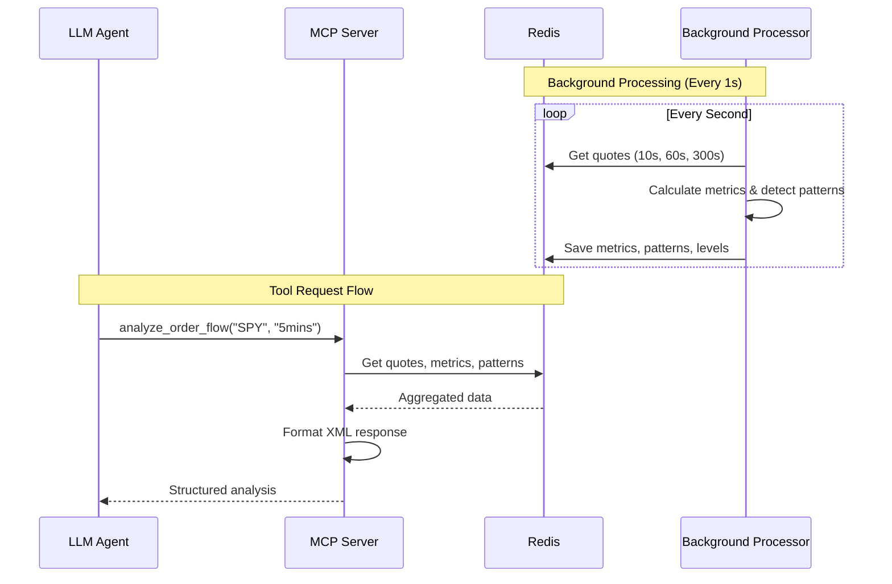

# MCP Order Flow Server

A Fast MCP server that provides real-time order flow analysis for options trading decisions. This server consumes quote data from Redis and provides structured analysis through MCP tools.

## 🎯 Overview

This server analyzes order flow data to help LLM agents make informed options trading decisions by providing:
- **Real-time momentum indicators**: Bid/ask lifts, drops, and price movements
- **Size dynamics**: Volume patterns, large order detection, acceleration
- **Pattern detection**: Absorption, stacking, sweeps, momentum shifts
- **Support/resistance levels**: Significant price levels from order flow
- **Market behavior flags**: Simple YES/NO indicators for LLM interpretation

## 🏗️ Architecture

### System Overview
```
[Data Broker] → Redis → [This Server] → MCP Tool → LLM Agent
                  ↑           ↓
                  └─ Background Processing (1s) ←┘
```

### Detailed Sequence Flow



[View complete sequence diagram →](docs/sequence_diagram.md)

## 🚀 Quick Start

### Prerequisites
- Python 3.10+
- Redis server running
- [mcp-trading-data-broker](https://github.com/private/mcp-trading-data-broker) publishing quotes

### Installation

```bash
# Clone repository
git clone https://github.com/yourusername/mcp-order-flow-server.git
cd mcp-order-flow-server

# Create virtual environment
python -m venv venv
source venv/bin/activate  # On Windows: venv\Scripts\activate

# Install dependencies
pip install -r requirements.txt
```

### Running the Server

```bash
# Quick start with helper script
chmod +x dev_start.sh
./dev_start.sh

# Or run directly
python -m src.mcp_server
```

## 📊 MCP Tool Reference

### `analyze_order_flow`

Analyzes order flow data for options trading decisions.

*Example Request:**
```python
result = await analyze_order_flow(
    ticker="SPY",
    history="5mins",
    include_patterns=True
)
```

**Example Response:**
```xml
<order_flow_data ticker="SPY" timestamp="2025-01-15T10:30:45" current_price="450.27">
  <current_quote>
    <bid price="450.25" size="5000" />
    <ask price="450.30" size="2000" />
    <bid_ask_ratio>2.5</bid_ask_ratio>
  </current_quote>
  
  <momentum>
    <last_10s>
      <bid_price_change>0.08</bid_price_change>
      <bid_lifts>3</bid_lifts>
    </last_10s>
    <last_60s>
      <bid_lifts>39</bid_lifts>
      <bid_drops>21</bid_drops>
    </last_60s>
  </momentum>
  
  <behaviors>
    <bid_stacking>YES</bid_stacking>
    <momentum_building>YES</momentum_building>
  </behaviors>
  
  <detected_patterns>
    <pattern>
      <type>absorption</type>
      <side>bid</side>
      <strength>strong</strength>
    </pattern>
  </detected_patterns>
</order_flow_data>
```

## 🔍 Pattern Detection

### Absorption Pattern
Detects large orders absorbing market flow at specific price levels.
- **Trigger**: Stable price with high volume (>8k avg size)
- **Significance**: Institutional accumulation/distribution

### Stacking Pattern
Identifies building walls of orders on bid or ask.
- **Trigger**: Consecutive large orders (>5k) with increasing sizes
- **Significance**: Support/resistance building

### Momentum Shift
Detects directional pressure changes.
- **Trigger**: 2:1 or greater lift/drop ratio
- **Significance**: Trend initiation or reversal

### Sweep Detection
Identifies sudden large size changes.
- **Trigger**: >15k size change between consecutive quotes
- **Significance**: Aggressive execution, stop hunting

## ⚙️ Configuration

### Environment Variables
```bash
# Redis Configuration
export REDIS_HOST=localhost
export REDIS_PORT=6379
export REDIS_DB=0
export REDIS_PASSWORD=

# Server Configuration
export LOG_LEVEL=INFO
export PROCESSOR_INTERVAL=1  # Processing frequency in seconds
```

### Redis Data Structure
| Key Pattern | Type | Description | TTL |
|-------------|------|-------------|-----|
| `orderflow:quotes:{ticker}` | Sorted Set | Raw quotes | 3600s |
| `orderflow:metrics:{ticker}:{window}` | Hash | Calculated metrics | 60-600s |
| `orderflow:patterns:{ticker}` | Sorted Set | Detected patterns | 3600s |
| `orderflow:levels:{ticker}:{side}` | Sorted Set | Price levels | 3600s |

## 🛠️ Development

### Project Structure
```
src/
├── mcp_server.py           # FastMCP server entry point
├── tools/
│   └── order_flow_tool.py  # MCP tool implementation
├── processors/
│   ├── order_flow_processor.py  # Main processing logic
│   ├── metrics_calculator.py    # Momentum & size metrics
│   ├── pattern_detector.py      # Pattern identification
│   └── behavior_analyzer.py     # Market behavior flags
├── storage/
│   └── redis_client.py     # Redis operations
└── formatters/
    └── state_manager.py    # XML response formatting
```

### Adding New Patterns

1. Add detection logic to `src/processors/pattern_detector.py`:
```python
def _detect_your_pattern(self, quotes: List[Dict]) -> Optional[Dict]:
    # Pattern detection logic
    return {
        'type': 'your_pattern',
        'timestamp': time.time() * 1000,
        # Pattern-specific fields
    }
```

2. Update pattern detector to call your method
3. Add XML formatting in state manager


## 🔗 Integration

### Claude Desktop Configuration
```json
{
  "mcpServers": {
    "order-flow": {
      "command": "python",
      "args": ["-m", "src.mcp_server"],
      "cwd": "/path/to/mcp-order-flow-server",
      "env": {
        "REDIS_HOST": "localhost",
        "REDIS_PORT": "6379"
      }
    }
  }
}
```
