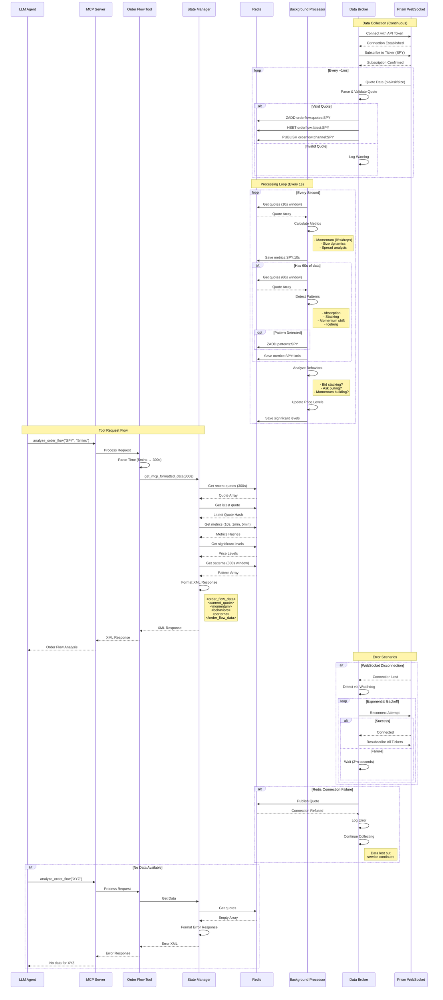

```mermaid
sequenceDiagram
    participant LLM as LLM Agent
    participant MCP as MCP Server
    participant Tool as Order Flow Tool
    participant State as State Manager
    participant Redis as Redis
    participant Processor as Background Processor
    participant Broker as Data Broker
    participant WS as Prism WebSocket

    %% Data Collection Flow
    Note over Broker,WS: Data Collection (Continuous)
    
    Broker->>WS: Connect with API Token
    WS-->>Broker: Connection Established
    
    Broker->>WS: Subscribe to Ticker (SPY)
    WS-->>Broker: Subscription Confirmed
    
    loop Every ~1ms
        WS->>Broker: Quote Data (bid/ask/size)
        Broker->>Broker: Parse & Validate Quote
        alt Valid Quote
            Broker->>Redis: ZADD orderflow:quotes:SPY
            Broker->>Redis: HSET orderflow:latest:SPY
            Broker->>Redis: PUBLISH orderflow:channel:SPY
        else Invalid Quote
            Broker->>Broker: Log Warning
        end
    end

    %% Background Processing Flow
    Note over Processor,Redis: Processing Loop (Every 1s)
    
    loop Every Second
        Processor->>Redis: Get quotes (10s window)
        Redis-->>Processor: Quote Array
        
        Processor->>Processor: Calculate Metrics
        Note right of Processor: - Momentum (lifts/drops)<br/>- Size dynamics<br/>- Spread analysis
        
        Processor->>Redis: Save metrics:SPY:10s
        
        alt Has 60s of data
            Processor->>Redis: Get quotes (60s window)
            Redis-->>Processor: Quote Array
            
            Processor->>Processor: Detect Patterns
            Note right of Processor: - Absorption<br/>- Stacking<br/>- Momentum shift<br/>- Iceberg
            
            opt Pattern Detected
                Processor->>Redis: ZADD patterns:SPY
            end
            
            Processor->>Redis: Save metrics:SPY:1min
        end
        
        Processor->>Processor: Analyze Behaviors
        Note right of Processor: - Bid stacking?<br/>- Ask pulling?<br/>- Momentum building?
        
        Processor->>Processor: Update Price Levels
        Processor->>Redis: Save significant levels
    end

    %% MCP Tool Request Flow
    Note over LLM,State: Tool Request Flow
    
    LLM->>MCP: analyze_order_flow("SPY", "5mins")
    MCP->>Tool: Process Request
    
    Tool->>Tool: Parse Time (5mins → 300s)
    Tool->>State: get_mcp_formatted_data(300s)
    
    State->>Redis: Get recent quotes (300s)
    Redis-->>State: Quote Array
    
    State->>Redis: Get latest quote
    Redis-->>State: Latest Quote Hash
    
    State->>Redis: Get metrics (10s, 1min, 5min)
    Redis-->>State: Metrics Hashes
    
    State->>Redis: Get significant levels
    Redis-->>State: Price Levels
    
    State->>Redis: Get patterns (300s window)
    Redis-->>State: Pattern Array
    
    State->>State: Format XML Response
    Note right of State: <order_flow_data><br/>  <current_quote><br/>  <momentum><br/>  <behaviors><br/>  <patterns><br/></order_flow_data>
    
    State-->>Tool: XML Response
    Tool-->>MCP: XML Response
    MCP-->>LLM: Order Flow Analysis

    %% Error Handling Flows
    Note over Broker,WS: Error Scenarios
    
    alt WebSocket Disconnection
        WS--xBroker: Connection Lost
        Broker->>Broker: Detect via Watchdog
        loop Exponential Backoff
            Broker->>WS: Reconnect Attempt
            alt Success
                WS-->>Broker: Connected
                Broker->>WS: Resubscribe All Tickers
            else Failure
                Broker->>Broker: Wait (2^n seconds)
            end
        end
    end

    alt Redis Connection Failure
        Broker->>Redis: Publish Quote
        Redis--xBroker: Connection Refused
        Broker->>Broker: Log Error
        Broker->>Broker: Continue Collecting
        Note right of Broker: Data lost but<br/>service continues
    end

    alt No Data Available
        LLM->>MCP: analyze_order_flow("XYZ")
        MCP->>Tool: Process Request
        Tool->>State: Get Data
        State->>Redis: Get quotes
        Redis-->>State: Empty Array
        State->>State: Format Error Response
        State-->>Tool: Error XML
        Tool-->>MCP: Error Response
        MCP-->>LLM: No data for XYZ
    end
```
